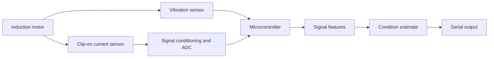

# InductiSense

**A motor-monitoring project by Ahmed Abdelrahman**

[](https://github.com/ahmedmuntasirarhman/inductisense/actions/workflows/ci.yml)

I built InductiSense to explore how electrical and vibration signals could help spot changes in an induction motor. The project combines motor-current analysis, signal processing, and embedded C++ code in a small, reproducible demonstration.


## How it works

The idea is to measure motor current with a clip-on current transformer and vibration with a small motion sensor. Software then looks for patterns—such as sidebands in the current signal or changes in vibration—and reports a possible condition to investigate.

The diagram shows the **intended system design**; it is not a photograph or a claim that the hardware has been built.



The software explores patterns associated with:

- **Rotor-bar issues:** current components around the electrical fundamental frequency.
- **Misalignment:** vibration near twice the shaft's rotational frequency.
- **Bearing roughness:** increased high-frequency vibration energy.

These patterns can have other causes, too. They are clues to investigate—not proof that a motor has a particular fault.

## What’s in the repository

- `analysis/` — signal generation, feature extraction, and the demo classifier.
- `firmware/` — portable C++ signal-processing and decision code, plus an ESP32-S3 starting sketch.
- `hardware/` — a reference parts list and wiring notes.
- `tests/` — automated checks for the Python analysis.
- `docs/` — engineering notes and a summary of what has been tested.

## Try the software demo

```bash
git clone https://github.com/ahmedmuntasirarhman/inductisense.git
cd inductisense
python3 -m venv .venv
. .venv/bin/activate
pip install -r requirements.txt
python analysis/train_demo.py --out docs/assets/condition-map.png --metrics docs/assets/demo_metrics.json
python -m unittest discover -s tests -v
```

The demo creates 120 simulated examples for each of four conditions, extracts nine features, and evaluates a nearest-centroid classifier. Its benchmark results are for **simulated signals only**; they do not show how accurately the system detects faults on real motors.

To run the portable C++ checks without an ESP32:

```bash
cd firmware
g++ -std=c++17 -Wall -Wextra -pedantic -Iinclude \
  src/SignalFeatures.cpp src/ConditionModel.cpp test/test_signal_features.cpp \
  -o /tmp/inductisense_firmware_test && /tmp/inductisense_firmware_test
```

## Current status

The simulation, signal-feature code, classifier demo, tests, and firmware decision core are in the repository. I haven’t built or measured a physical motor prototype. The ESP32 sketch is an early starting point: it reads the board’s analogue input, and its vibration values are simulations rather than readings from a connected sensor.


## License

MIT — see [LICENSE](LICENSE).
