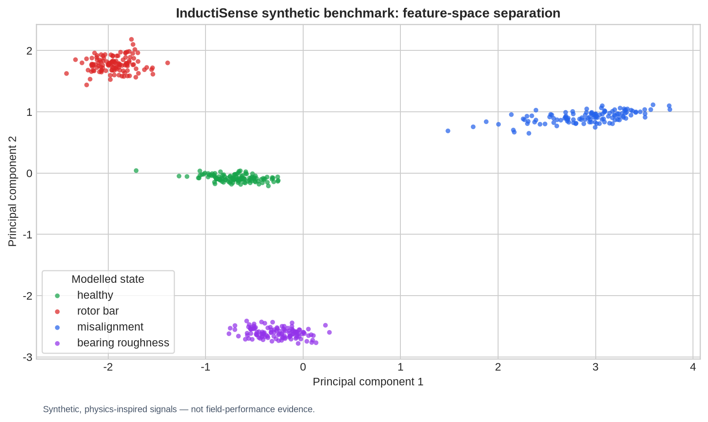
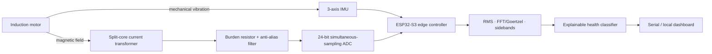

# InductiSense

> **An edge-AI condition-monitoring platform for small induction motors**
> Designed and authored by **Ahmed Abdelrahman**

[](https://github.com/ahmedmuntasirarhman/inductisense/actions/workflows/ci.yml)


**InductiSense** is a safe, low-cost proof-of-concept for identifying early motor faults from **motor-current signature analysis (MCSA)** and vibration sensing. It brings together embedded systems, analogue measurement, digital signal processing, and explainable machine learning in one university-application-ready engineering project.

The project deliberately keeps the sensing chain isolated from mains voltage: a clip-on current transformer and an isolated wall-powered controller form the recommended prototype. The signal-analysis core can be validated entirely with the included reproducible simulation before connecting to any machine.



## Why it is interesting

Many small induction motors operate until failure because industrial condition-monitoring equipment is expensive. InductiSense explores a practical alternative:

- **Current signature analysis:** detects fault-related sidebands around the electrical fundamental.
- **Vibration analysis:** separates mechanical signatures such as misalignment and bearing roughness.
- **Edge inference:** converts transparent frequency-domain features into a local health decision.
- **Reproducible engineering:** includes a deterministic synthetic-data benchmark, unit tests, a hardware bill of materials, and a validation plan.

> This is a **diagnostic prototype**, not a safety-rated protection device. Do not use it to make safety-critical shutdown decisions.

## System architecture



## Fault signatures explored

| Operating state | Electrical / mechanical indicator | Engineering interpretation |
|---|---|---|
| Healthy | Low current-sideband energy, low high-frequency vibration | Baseline operating condition |
| Rotor-bar anomaly | Elevated current components near `f₁ ± 2sf₁` | Possible broken/loose rotor-bar signature |
| Shaft misalignment | Strong `2×` rotational vibration component | Mechanical alignment issue candidate |
| Bearing roughness | Elevated high-frequency vibration energy | Bearing-surface degradation candidate |

`f₁` is line frequency and `s` is estimated slip. The labels above are **screening indicators**, not a substitute for teardown inspection.

## Repository map

```text
analysis/                 Reproducible simulation and feature extractor
firmware/                 Portable C++ DSP / decision core + PlatformIO skeleton
hardware/                 Safe prototype wiring, block diagram, BOM
scripts/                  Build and analysis helpers
tests/                    Python regression tests
docs/                     Engineering notebook, validation plan, application brief
.github/workflows/        Continuous integration
```

## Quick start

```bash
git clone https://github.com/ahmedmuntasirarhman/inductisense.git
cd inductisense
python3 -m venv .venv
. .venv/bin/activate
pip install -r requirements.txt
python analysis/train_demo.py --out docs/assets/condition-map.png --metrics docs/assets/demo_metrics.json
python -m unittest discover -s tests -v
```

Run the portable embedded-core test without an ESP32:

```bash
cd firmware
g++ -std=c++17 -Wall -Wextra -pedantic -Iinclude \
  src/SignalFeatures.cpp src/ConditionModel.cpp test/test_signal_features.cpp \
  -o /tmp/inductisense_firmware_test && /tmp/inductisense_firmware_test
```

## Measured by the included demonstration

The simulated benchmark creates 120 seeded examples for each of four operating states, extracts nine engineering features, trains a nearest-centroid model, and reports held-out accuracy. Run the command above to regenerate the figure and exact metrics. The result validates the **pipeline on modeled signals only**—it is not a claim of field accuracy.

## Build safely

- Start with a **split-core CT** clamped around one insulated conductor; never create an exposed mains connection.
- Power the controller from a certified, isolated USB or 12 V wall adapter.
- Build and test first with the simulation or a low-voltage function-generator signal.
- If instrumenting a real motor, work with a qualified supervisor and follow local electrical safety rules.

See [hardware/wiring.md](hardware/wiring.md) and [hardware/BOM.csv](hardware/BOM.csv).

## Project status and evidence

The software demonstration, analysis pipeline, portable C++ feature/decision core, regression tests, documentation, and GitHub Actions workflow are implemented. The benchmark currently evaluates four intentionally separable **synthetic** operating-state classes; its score measures performance on that generated dataset only.

No physical motor prototype has been assembled or measured in this project. The ESP32-S3 entry point is a bring-up skeleton: ADC acquisition uses the MCU's analogue input, and the vibration features are demonstration values rather than readings from a connected IMU. No calibration, real-motor fault diagnosis, or safety certification is claimed. The wiring guide is a design reference, not an instruction to energize an unreviewed circuit.

## License

MIT © 2026 Ahmed Abdelrahman. See [LICENSE](LICENSE).
