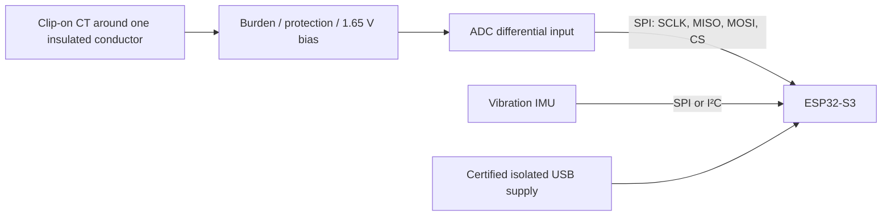

# Safe prototype wiring guide

> **Safety boundary:** This project is designed to sense a motor non-invasively. Keep all electronics powered from an isolated low-voltage supply and do not make an exposed connection to mains conductors. If the motor installation must be opened, stop and involve a qualified supervisor/electrician.

## Recommended proof-of-concept topology

The companion [block diagram](system-block-diagram.mmd) is editable Mermaid source.

## Low-voltage interconnect plan

| Module | ESP32-S3 interface | Suggested connections | Notes |
|---|---|---|---|
| ADS131M02 / ADC | SPI | SCLK, MISO, MOSI, CS, DRDY, 3V3, GND | Follow the converter datasheet for reference, input range, and layout; do not copy pin values blindly. |
| ICM-42688-P / ADXL345 | SPI or I²C | SDA/SCL or shared SPI plus dedicated CS, INT, 3V3, GND | Verify the breakout board's logic-voltage compatibility. |
| Analogue front end | ADC input | CT signal → protection → bias/filter → ADC | Use a CT with a known burden/output arrangement. Confirm maximum current cannot overdrive the ADC. |
| Debug | USB serial | USB-C / UART | Keep the laptop supply appropriately isolated from the apparatus. |

## Bring-up sequence

1. Run the Python benchmark before assembling hardware: `python analysis/train_demo.py`.
2. Power the ESP32 and IMU from USB only; verify sensor ID and stationary noise floor.
3. Inject a **low-voltage** sine wave from an isolated function generator into the front end; compare reported RMS/amplitude with the generator setting.
4. Clamp the CT around a single insulated conductor only after a supervisor reviews the setup. Never place a CT around an entire multi-core cable where phase and return currents cancel.
5. Log a healthy baseline at several steady loads. Record motor model, nominal current, load condition, sample rate, and sensor placement.
6. Treat any anomaly output as an investigation prompt, not a trip signal.

## Design-review checklist

- [ ] CT voltage and maximum possible current are bounded below the ADC input limit.
- [ ] All external wiring has strain relief and an insulated enclosure.
- [ ] Analogue and digital grounds follow the selected ADC reference design.
- [ ] Anti-alias filtering is matched to the actual sample rate.
- [ ] A reference meter/power analyser is available for gain and phase calibration.
- [ ] Measurements, firmware commit, and test conditions are logged.

## Datasheet starting points

- [Texas Instruments ADS131M02](https://www.ti.com/product/ADS131M02)
- [Espressif ESP32-S3](https://www.espressif.com/en/products/socs/esp32-s3)
- [TDK InvenSense ICM-42688-P](https://invensense.tdk.com/products/motion-tracking/6-axis/icm-42688-p/)

Always consult the current manufacturer documentation before ordering or wiring parts.
